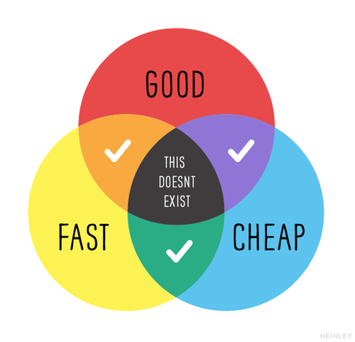

# How to work with me

✅ **What this document is**

- A snapshot of who I am, my quirks, and what it’s like to work with me at **this** point in time
- Hopefully, a way for you and I to improve how we work together

❌ **What this document _is not_**

- A permanent document of who I am (I will try and update this over time)
- A "hack" for genuine relationship-building or 1x1s with me
- An excuse for any unpleasant interactions you may have with me

### On-brand Johnny stuff 👨🏾‍🦲

I write a lot. It helps me think, focus and drive clarity. I encourage you to write more than you're used to. With disparate schedules and odd hours, thoughtful writing can be a great way to communicate with your peers. I listen more than I talk. I hire people who are smarter than me so I can learn from them and so they can own their jobs.

## Expectations

**My peers and stakeholders**
    
I expect my peers to have an appreciation for the level of complexity and uncertainty inherent to the software development process. I realize it can be frustrating to not fully understand the details of why building a thing takes a while. Still, I have an extraordinarily talented team that cares deeply about the problems we're trying to solve. If it's taking a while, it's because we're trying to deliver the best solution possible (under the given constraints of time, resources, and people). We can ~always~ sometimes go faster, but it's never without cost. See the image below. In this instance, "good" can be summarized as the quality of software relative to bugs and other defects and/or performance of said system when performance is an important factor.

  

    
**Understanding diminishing returns**
    
It can be tempting to assume that adding more engineers will make the machine move faster. In some instances, this is helpful, but in many, it is not. This is the case when the tasks to be completed have reached maximum concurrency. Every outstanding task either has someone working on it, or pending tasks *can't* be worked on, until other tasks are completed. Another situation is when time is really short. The overhead of adding and onboarding a new engineer to a project can exceed the amount of time left to finish the work. In both of these cases, the right (and difficult) thing to do, is let the existing team progress with minimal distraction.
    
**My team**
    
Quite simply put, I expect your best. If I asked you to be on the team, it means I believe in you and your ability to be excellent and I trust you. We have a strong mission and an opportunity to build a great business. I need you to:
    
- Keep an eye on the big picture
- Hold each other (and me) accountable
- Always be learning
- Be generous with your knowledge
- Give feedback, frequently and respectfully. Receive it, gracefully
- Work smart when you can, work hard when you need to. Remember, in order to _get_ smart, you have to work hard. No shortcuts!
- Take care of yourself
    
**I expect senior ICs and managers to create the reality they want to see**. Tell me what you plan to do, instead of waiting for me to shape reality for you. If you're stuck, tell me and I'll help. You're the driver. Again, you have my trust. If you don’t see the big picture, that’s my fault. Let me know, and I’ll get you oriented.
    
Not hitting a deadline is not the end of the world. Not hitting a deadline and not letting me know until it's too late to do anything about it is unacceptable. Give accurate status updates. People who only tell me what they think I want to hear are pet peeves.
    
I expect debate to be respectful and grounded in data and not personal preferences. **Once a decision is made, I expect full commitment from everyone**, regardless of whether or not you agreed with the decision.

Your career is your journey - you're the driver and the navigator. I'm your navigation software. Tell me where you want to go, and I'll help you get there. I won't be helpful if you tell me where you want to go and don't drive. If you drive and do not tell me where you want to go, you'll end up somewhere, but I can't predict where.

### How I Learn

💡 **TL;DR Big picture first. *Maybe* details later**

I'm a top-down learner. I need big picture context before drilling into details. Because of this, I can sometimes be somewhat dismissive of details if it's not relevant to the big picture. It's not because details aren't important, it's because I trust my team and so I tend to have a background mental process of "my team will solve this detailed problem - I don't need to spend cycles on it."

When details *are* involved, I learn by digging in. I'll gather enough information from reading to get started but need to start building something before I feel like I'm actually learning.

### My Kryptonites (Failure Modes)

**Manager/Maker Split Brain**

The thing I struggle most with is being split brain between engineering details and big picture thinking. I can switch back and forth at surface level, but I can only be deeply focused on one at a time. This typically manifests as:

- If I'm focused on building something - I'll seem withdrawn from bigger conversations. It takes me a while to ramp up to that mode of thinking in a meeting which may make me seem like I'm not interested which isn't the case - I'm likely contemplating some mundane bug or thinking about why my tests aren't passing. Because of this, I might relegate engineering work to nights or weekends or block off hours of my day so I can concentrate. Also, I'll be slower to respond to emails and slack. Also, why are you emailing me? 😂
- If I'm focused on big picture stuff, I will leave lots of unfinished coding tasks (or things that take a long time) on my plate because I need a lot of time to get into the headspace of an engineer and be productive. And once I'm there, I'll fight to stay there because of the cost associated with "coming up for air." I can go weeks or even months without diving into a maker mindset. I love coding, but I don’t need to do it to feel fulfilled.

**Biases**

I tend to assume that my preferences for working, strengths and weaknesses apply to others. For example: As a junior and mid level engineer, I was put on projects by myself quite often and was not expected to give many updates along the way. As a result, I have a weird comfort zone of working alone and with no feedback on fairly sizable projects. I'm very comfortable there, others may not be. I sometimes need to be reminded of this.

Also, I'm not a great on-the-spot brain stormer. I like to take a problem and think deeply about it for a while. Once I've had an opportunity to do that, I'm happy to brain storm after the fact. Many people feed off the energy of an ad-hoc brain storm, so I need to work extra hard to make space for that.

### My Boundaries

**I Can't Make You Happy**

I'm a darn good manager and leader, but a crappy therapist. [I can't help you find happiness or fulfillment](https://www.linkedin.com/pulse/its-your-job-make-team-happy-johnny-ray-austin-fvquc/). I can set context, tell you what success looks like, ensure your work has impact, give you feedback and reward you, but whether or not that makes you happy is something I'm not qualified to address. Similarly, telling me about your work-related problems for brainstorming solutions is great, but venting is not. If all of my reports vented to me, I'd be a dumping ground for negative emotions. This, in turn, impedes my ability to be energetic and do my job effectively.

### Thoughts on tech and builds

When it comes to tech, there are very few hills on which I can see myself dying. I have strong opinions on just a few things. I prefer to focus my energy on outcomes and the problem at hand. Frameworks, libraries, design patterns, etc., are tools to accomplish a goal. None of them are intrinsically "good" or "bad."

I prefer a "good enough for the foreseeable future" approach to iteration. Designing and building for too far in the future is a fool's errand as you'll almost always be wrong. However, building on too short of a time scale in favor of hitting an arbitrary deadline can be equally detrimental to long-term viability. Accruing tech debt to ship faster is fine as long as you understand the consequences and plan to pay down the debt soon after that. If you fail to do that, that debt *will* come due, and you'll find yourself at a standstill - unable to make relatively minor changes on a reasonable timeline while competitors speed past you.

### Let me know if...

- I do something that feels more like telling you how to do your job than setting context, you'd be doing me a huge favor if you let me know about it as soon as possible.
- You’re lost in the minutia and need a big picture refresher. You should always be able to draw a line from your day-to-day tasks to the company’s goals. If you can’t draw that line, throw a flag and let’s talk about it.
- I'm not responsive enough to your needs - particularly if it impedes your ability to do your job.
